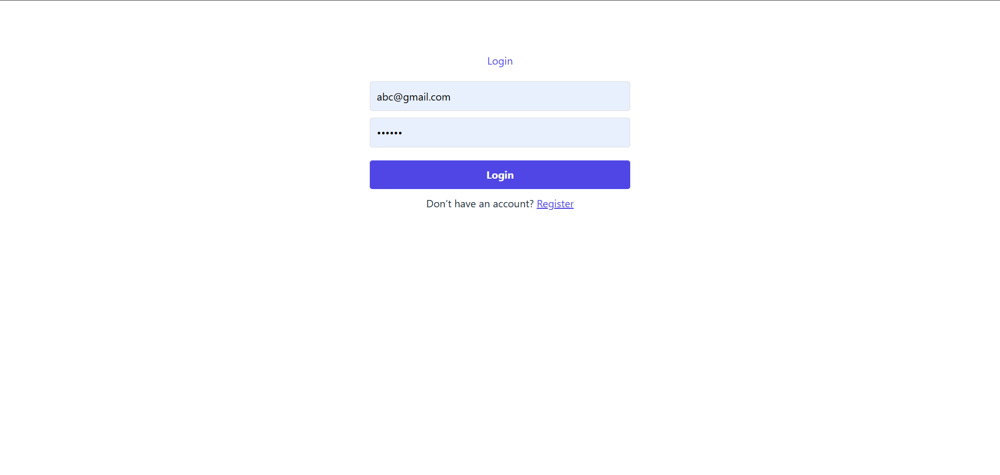
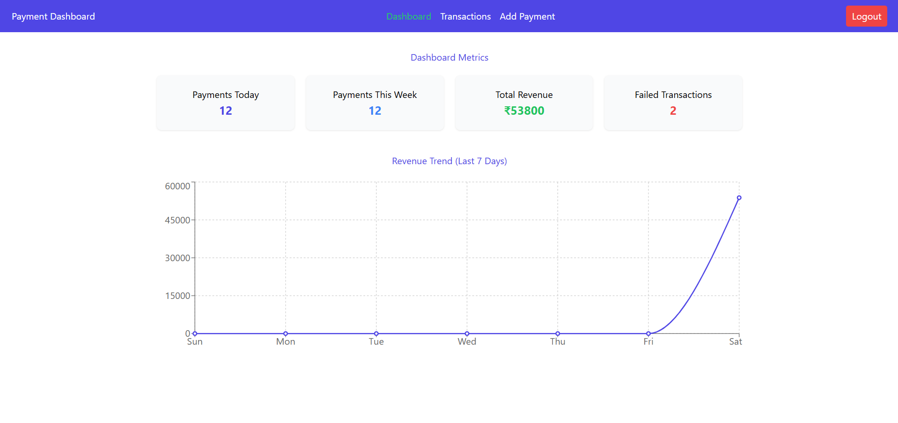
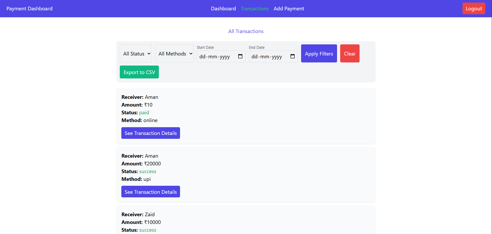

# 📦 Assignment - Arsh Ansari

A simple full-stack application using the MERN stack (MongoDB, Express.js, React.js, Node.js). This repo is divided into two parts:

- `/client` – React frontend
- `/server` – Node.js & Express backend

---

## 🚀 Tech Stack

**Frontend:**
- React.js
- Axios
- CSS / Tailwind (if used)

**Backend:**
- Node.js
- Express.js
- MongoDB (via Mongoose)
- dotenv (for environment variables)
- nodemon (for development)


---
## 🖼 Screenshots

<div align="center">

<table>
<tr>
<td></td>
<td></td>
</tr>
<tr>
<td></td>
<td></td>
</tr>
</table>

</div>


---

## ⚙️ Setup Instructions

### 🔧 Prerequisites

- Node.js and npm installed
- MongoDB installed or [MongoDB Atlas](https://www.mongodb.com/cloud/atlas) account

---

### 🛠 Backend Setup
1. Navigate to the server folder:
```bash
cd server
```
2. Install dependencies:
```bash
npm install
```

3. Create a .env file:
``` bash
PORT=5000
MONGO_URI=your_mongodb_connection_string
```

4. Start the server:
```bash
npm run dev
```

🌐 Frontend Setup
1. Open a new terminal and navigate to the client folder:

```bash
cd client
```

2. Install dependencies:
``` bash
npm install
```

3. Start the frontend:
```bash
npm start
```
## .

🔑 Sample User Credentials (if applicable)
```bash
Email: abc@gmail.com
Password: 123456
```
